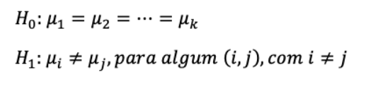
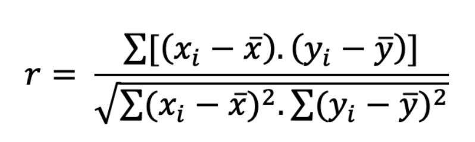
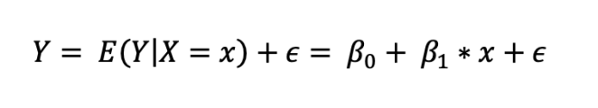
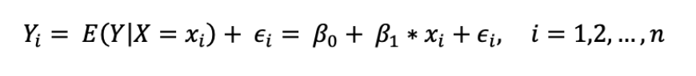
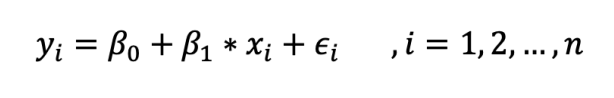
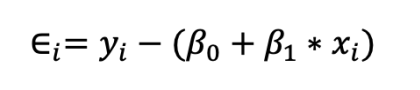
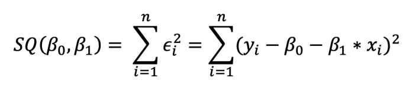
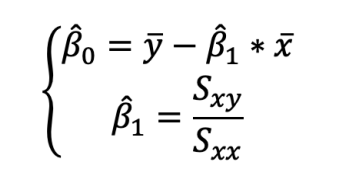
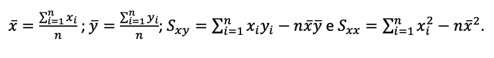

# Conceitos Chave

## Testes de Hipótese Paramétricos

A comparação de médias mais simples passível de ser efetuada é a comparação da média de uma variável contínua com um valor conhecido, através do **teste t para uma amostra**.
Para a realização deste teste, é necessário que sejam cumpridas duas assunções:
(i) a variável contínua deve estar normalmente distribuída na população (à semelhança do que se verifica para todos os testes paramétricos); e
(ii) as observações devem ser independentes.

Para comparar a média de uma variável contínua entre duas amostras, deve aplicar-se um teste t para duas amostras. Se as amostras não forem independentes (i.e., se estas forem emparelhadas), aplica-se o **teste t para amostras emparelhadas**, desde que sejam cumpridas
duas assunções:
(i) a diferença entre as variáveis contínuas segue uma distribuição normal; e
(ii) as observações são emparelhadas.

Por outro lado, se as observações nas duas amostras forem independentes, pode aplicar-se o teste t para amostras independentes. Existem duas versões deste teste, requerendo ambas o cumprimento de duas assunções:
(i) a variável contínua está normalmente distribuída nos dois grupos; e
(ii) as observações são independentes.

A primeira versão deste teste, o **teste t de Student para amostras independentes**, apresenta ainda uma terceira assunção, que deve ser verificada sempre que o mesmo é executado:
a homogeneidade das variâncias (ou homocedasticidade) — isto é, o teste t de Student para amostras independentes tem, como pressuposto, que a variância é igual nas duas populações.
Para verificar o cumprimento desta assunção, deve ser realizado o **teste de Levene** (ou a sua versão mais robusta, o teste de Brown-Forsythe).
O **teste t de Welch** para amostras independentes é uma versão modificada do teste t que não requer o cumprimento da assunção da homocedasticidade.

## Comparação de variáveis numéricas com mais do que duas categorias

### ANOVA

Iremos abordar métodos de inferência estatística para as situações em que tenhamos três ou mais amostras independentes, utilizando as abordagens paramétrica e não-paramétrica.

Teste paramétrico: **One-way Analysis of Variance (ANOVA)**

O one-way ANOVA é utilizada para testar a seguinte hipótese:

Ou seja, serve para testar a hipótese nula (H0) de que as médias de três ou mais (k) grupos independentes são iguais, contra a hipótese alternativa (H1) de que pelo menos duas delas são diferentes entre si.

Conforme o nome indica, este teste baseia-se na decomposição da variância total, em termos das componentes de variação entre grupos (“between groups”) e dentro dos grupos (“within groups”).

As assunções a serem cumpridas na aplicação do one-way ANOVA são as seguintes:
- Independência das observações (tal como foi visto nos testes t);
- Distribuição normal da variável para cada um dos k grupos;
- Homogeneidade das variâncias, i.e., a variância deve ser idêntica nos k grupos.

Existe, porém, a **correção de Welch** do teste one-way
ANOVA, caso a assunção da igualdade das variâncias não se verifique.

### ANOVA - Análises Post-hoc

Para aferirmos quais os pares de médias que são significativamente diferentes entre si, recorre-se a uma análise a posteriori (post-hoc), utilizando métodos como Bonferroni, Holm ou Least Square DIfferences (LSD), que fornece uma tabela com os valores p relativos a todas as comparações de médias duas a duas.

### Kruskal-Wallis

No caso de não se verificarem as assunções do one-way ANOVA, devemos então recorrer ao teste não paramétrico **Kruskal-Wallis**.

O teste de Kruskal-Wallis (KW) é uma alternativa para a comparação das observações de uma dada variável entre três ou mais grupos independentes, quando não é possível aplicar o one-way ANOVA.
No entanto, este teste não serve para avaliar a tendência central, mas sim se as distribuições dos diferentes grupos são ou não semelhantes (o teste de KW não é um teste de medianas).
Apenas se poderia considerar como um teste de medianas se a distribuição dos diferentes grupos fosse a mesma, o que não é comum. Assim, o que se pode afirmar sempre é que, tal como o teste de Mann-Whitney, uma vez que o teste de KW se baseia na posição (rank) das observações, a hipótese nula consiste em assumir que as amostras dos diferentes grupos têm a mesma distribuição.

### Kruskal-Wallis - Análises Post-hoc

Para aferir quais os grupos cuja distribuição é diferente entre si, não é apropriado recorrer a múltiplos testes de Mann-Whitney, uma vez que o teste de Mann-Whitney não utilizará os mesmos ranks utilizados no teste de KW nas comparações. Assim, está indicado recorrer ao **teste de Dunn** ou ao teste de **Conover-Iman**.

## Comparação de variáveis categóricas

### Contagens esperadas vs. observadas

A contagem observada para cada célula é, como o nome indica, aquilo que observamos na nossa amostra. Por outro lado, a contagem esperada é o valor que esperaríamos ter em cada célula caso não houvesse qualquer relação entre as duas variáveis em estudo.

### Teste do χ2, Teste Exato de Fisher

Quando queremos saber se a associação entre duas variáveis categóricas é estatisticamente significativa, podemos recorrer ao **teste do χ2 (qui-quadrado)**. Tal como os outros testes de hipótese abordados nas aulas anteriores, assume-se como hipótese nula a ausência de associação entre as variáveis em estudo, e calcula-se a probabilidade de ter uma observação tão ou mais diferente do esperado do que a que se verifica na nossa amostra. Obtemos então um valor de p, que utilizamos para rejeitar (ou não) a hipótese nula, consoante o valor de α (limiar de significância) que tiver sido previamente definido.
O teste do χ2 tem um pressuposto a ser cumprido para poder ser realizado: as contagens esperadas apenas podem ser inferiores a 5 em 20% das células. Numa tabela de 2×2 células, basta que uma única célula tenha uma contagem esperada inferior a 5 para que sejam 25% as células com contagem esperada inferior a 5, o que proscreve por si só o teste do χ2. Neste caso, é necessário recorrer ao teste exato de Fisher. Certas fontes referem que o teste exato de Fisher apenas pode ser aplicado a uma tabela de 2×2 células, mas essa limitação era fruto da ausência de poder computacional. O teste fica exponencialmente mais exigente com o aumento do tamanho da tabela, mas não existe nenhuma limitação por princípio, e os computadores de que dispomos atualmente conseguem realizar o teste em tabelas maiores.

### Observações emparelhadas e teste de McNemar

Caso as duas variáveis em estudo evidenciem emparelhamento (por exemplo, duas observações no mesmo indivíduo, em tempos diferentes), tal como ocorria nas variáveis contínuas, existe um teste de hipótese mais apropriado para este tipo de observações: o **teste de McNemar**.
A interpretação dos resultados é igual a qualquer outro teste de hipótese, pelo que o essencial será compreender as indicações para a seleção deste em vez de um χ2 ou teste exato de Fisher.

## Correlação

**Coeficiente de correlação de Pearson**

Por vezes, existe interesse em analisar a associação entre duas variáveis quantitativas, como, por exemplo, a associação entre o peso e a altura de uma amostra de indivíduos ou a associação entre as horas semanais a jogar PlayStation e o aproveitamento escolar de um grupo de alunos.
Em primeiro lugar, deve ser feito o gráfico de dispersão destas duas variáveis, pois a nuvem de pontos pode ser útil para perceber se existe uma associação entre as variáveis e, se existir, qual a sua natureza (linear, quadrática, logarítmica, exponencial, entre outras). De seguida, pode calcular-se o **coeficiente de correlação linear (r)** entre as variáveis. Este coeficiente é também conhecido como coeficiente de correlação de Pearson e avalia a intensidade da associação linear (ou seja, em forma de reta) entre as duas variáveis. Como o modelo linear é simples de interpretar e é bem conhecido, é natural que se comece por avaliar a adequabilidade deste modelo aos dados.
Este coeficiente **varia de -1 a 1**, com valores próximos de 0 indicando que não existe associação linear entre as variáveis. Valores próximos de 1 indicam associação linear positiva, ou seja, à medida que uma variável aumenta, a outra também aumenta (no gráfico de dispersão, a nuvem de pontos aproxima-se de uma reta de sentido crescente). Valores próximos de -1 indicam associação linear negativa, ou seja, à medida que uma variável aumenta, a outra diminui (no gráfico de dispersão, a nuvem de pontos aproxima-se de uma reta de sentido decrescente).
A interpretação dos valores de r não é consensual e varia de autor para autor. No entanto, uma possível interpretação é a apresentada no livro de Mukaka (M. M. Mukaka, “A Guide to Appropriate Use of Correlation Coefficient in Medical Research,” MMJ, Vol. 24, No. 3, 2012, pp. 69-71):
- |r| ≥ 0.9, correlação linear muito forte.
- |r| = 1, correlação linear perfeita.
- 0.7 ≤|r| < 0.9, correlação linear forte.
- 0.5 ≤|r| < 0.7, correlação linear moderada.
- 0.3 ≤|r| < 0.5, correlação linear fraca.
- 0 ≤|r| < 0.3, correlação linear desprezível.

Note-se que esta classificação é para valores absolutos de r. No caso de valores de r positivos, acrescenta-se que a correlação linear é positiva (por exemplo, correlação linear positiva forte), e para valores de r negativos, acrescenta-se que a correlação linear é negativa (por exemplo, correlação linear negativa forte).

O coeficiente de correlação linear é calculado pela seguinte fórmula matemática:

onde xi e yi são os valores das variáveis X e Y e x̄ e ȳ são, respetivamente, as médias das variáveis X e Y.
Por vezes, pode existir interesse em tirar conclusões sobre o coeficiente de correlação da população (ρ) de onde a amostra foi retirada. Nessa situação, recorre-se a um teste de hipótese que testa se a correlação populacional, representada por ρ, é significativamente diferente de zero (o valor mais comum é zero, mas pode ser usado outro valor de teste). A aplicação deste teste para o coeficiente de Pearson pressupõe que as observações são independentes e que as duas variáveis seguem uma distribuição normal bivariada.

**Coeficiente de correlação de Spearman**

Quando se pretende analisar a associação entre duas variáveis qualitativas ordinais, ou na presença de outliers, deve-se calcular o coeficiente de Spearman, denotado por Sp, uma versão não paramétrica do coeficiente de Pearson. O coeficiente de Spearman utiliza, em vez do valor observado, apenas a ordem das observações, pelo que não é sensível à presença de outliers.
À semelhança do coeficiente de Pearson, o coeficiente de Spearman varia entre -1 e 1. Quanto mais próximo estiver destes extremos, maior será a associação entre as variáveis. O sinal negativo da correlação significa que as variáveis variam em sentido contrário, ou seja, as categorias mais elevadas de uma variável estão associadas a categorias mais baixas da outra variável.

**Regressão linear**

No modelo de regressão linear simples, pretende-se estudar se a variável independente (também denominada de variável explicativa) explica a variável dependente (também denominada de variável de outcome), sendo que esta variável dependente é uma variável contínua (a variável independente pode ser categórica ou contínua). Pretende-se, através do modelo, que não é mais do que uma expressão matemática, estimar o valor da variável dependente, dado um determinado valor da variável independente. Por exemplo, dado o número de horas semanais a estudar DECIDES I, podemos querer estimar a classificação final de um determinado aluno.
Tal como o nome do modelo sugere, a função matemática que descreve este modelo é uma função linear (cujo gráfico é dado por uma reta), do tipo Y = b1* X + b0, em que Y é a variável dependente, X é a variável independente, b0 é a ordenada na origem e b1 é o declive da reta.
Note-se que este modelo será apenas uma aproximação aos dados, pelo que terá sempre erros associados. Neste sentido, o modelo de regressão linear simples é dado pela seguinte expressão:

sendo E o valor esperado, β0 o coeficiente de regressão representativo da ordenada na origem, β1 o coeficiente de regressão que representa o declive e ϵ o erro aleatório, ou seja, tudo o que influencia o comportamento da variável Y, mas que não é explicado linearmente pela variável X.
Considerando n observações da variável X: x1,x2,x3,…,xn, obtém-se n variáveis aleatórias
Y1,Y2,…,Yn que satisfazem a expressão anterior:

Assumimos que as variáveis aleatórias ϵi são independentes, com média 0 e a mesma variância σ2 (estes são os pressupostos que devemos verificar no final do modelo estimado: normalidade e homocedasticidade dos resíduos).
Numa amostra de n sujeitos, obtém-se n pares (xi,yi), i=1,2,…,n, que devem satisfazer o seguinte modelo:

Temos assim n equações e n + 2 incógnitas (β0, β1, ϵ1, …, ϵn), pelo que é necessário encontrar um método que permita estimar os valores de β0 e β1.
O método aplicado denomina-se de Método dos Mínimos Quadrados (MMQ, ou OLS de ordinary least squares) e consiste em determinar os valores de β0 e β1 que minimizam a soma dos quadrados dos erros, dados por:

A quantidade de informação perdida pelo modelo ou soma dos quadrados dos resíduos é dada por:

Derivando em relação a β0 e β1, igualando as duas expressões a 0 e, resolvendo o sistema em ordem a β0 e β1, encontramos as respetivas estimativas:

em que,

Assim sendo, a equação da reta de regressão estimada é dada por Logo, β̂0 é o ponto de interseção da reta com o eixo das ordenadas (x = 0), e pode ser interpretável ou não, dependendo do contexto. β̂1 é o declive da reta e representa o quanto varia a média de Y para um aumento de uma unidade da variável X.