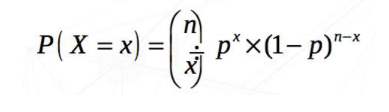
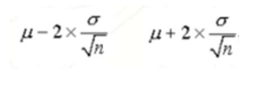
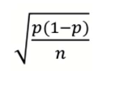

# Lesson 3 - Probability Distributions; Sampling and estimation

**Topic**: Probability Distributions; Sampling and estimation

## Probability Distributions

### Introduction

A random variable (experiment) can take any value (result) with a given probability within a set of values (sample space).

A probability distribution shows the probability of all possible values of a variable.

### Probability Distribution - Bernoulli

In categorical variables the distribution associates a probability to each category.

Coding male=1 and female=0 we can use both probabilities in the same equation

\( p(\text{gender} = x) = p^x \cdot (1 - p)^{(1-x)} \)

\( p(\text{gender} = 1) = p^1 \cdot (1 - p)^0 = p \)

\( p(\text{gender} = 0) = p^0 \cdot (1 - p)^1 = 1 - p \)

This function is called Bernoulli distribution and represents the probability distribution of a dichotomous variable

The variable "gender of newborn" follows a Bernoulli distribution with probability \( p \):

\( \text{gender} \sim \text{Ber}(p) \)

### Probability Distribution - Binomial

**Example:** Consider a group of 100 newborns. So, what is the probability of observing exactly 70 newborn boys?

If X is the number of boys of a total of n newborns and p the probability of being a boy, then X follows a
binomial distribution

X ~ Bin(n,p)
The mean of X is np and the variance is np(1-p)

### Probability Distribution - Poisson

But, if instead of X being the number of boys in a sample of 100 babies, so a limited number of events, it was, for example, the number of epileptic seizures in a month?

In this case, the distribution could be a Poisson.

In reality, there are a huge number of theoretical distributions and we just need to choose the one which better represents our data.

### Density

For continuous variables, we can not present the probability of a given value.

Instead of that, we can present the probability of an interval of values.

Imagine that we can choose smaller and smaller intervals.

As the intervals get shorter we start seeing a curve called probability density.

The most famous is the Normal distribution, also called Gaussian curve, but there are many other.

But, why do we like to fit theoretical distribution to our data?

When the empirical frequency distribution of the variable that we are studying approaches a theoretical distribution of probabilities (distribution described with a mathematical model) we can use the theoretical knowledge we have about this distribution to answer data-related questions.

### Normal Distribution

This is the most famous of all theoretical distributions.

*But, why?*

- Has interesting properties
- Many biological variables have a distribution similar to a normal distribution and that allows us to use the properties and theoretical knowledge that we have about this to explore our data.

- Is completely defined by the mean (μ) standard deviation (σ)
- Symmetrical with respect to the mean (mean=median)

**Example:**
Assuming a normal distribution, we can see that 95% of the newborn weighing between 2227 and 4331 (mean=3279 and sd=526) is
- 3279 –2×526 = 2227
- 3279 + 2×526 = 433

We can transform any normal distribution into the standard distribution. For that, we need to subtract from each value the sample mean and divide by the standard deviation **(z-score)**.

The standard normal distribution has mean = 0 and sd = 1.

**Example:**
Instead of saying that the baby weight was 2130 g...
We can compute the z-score (2130-3279)/526 and say that:
The baby was born with a z-score=-2.37, that is, the baby was 2.37 standard deviations below the mean.

## Sampling and estimation

**Population:** Group of individual that we care about
**Sample:** We believe is representative of the population, we will use it to infer conclusions for it

The quality of the sample (not skewed or representative) is as  important as its size.
But how do you get a representative sample of population?

### Random Sampling

**Simple random samples**: All individuals have equal and independent probabilities of being selected, e.g. the probability of an individual being chosen follows a uniform distribution.

**Stratified:** The population is divided into strata by a variable of interest, and within these strata individuals are randomly chosen.

**By groups:** There are 2 or more stages in the sampling process:
1. The groups are chosen randomly
2. Within these groups all individuals are chosen or only a few are randomly selected

## Estimating the average of a population

- We cannot know the population average m.
- But we can estimate this average with a sample average x
- We take repeated samples of the same size n and calculate the sample mean of each of theses samples.

**Distribution of sample means**

If we look into the distribution of all possible sample averages it can be shown (using Central Limit Theorem) that:

- this distribution of the sample means follows a Normal distribution regardless of the distribution of the original data;
- the average of the mean estimates is equal to the population mean (m);
- the standard deviation of the mean estimates is equal to the population standard deviation (s) of the original data divided by the square root of the sample size (n);
- the standard deviation of this distribution is usually called standard error of the mean.

**Mean standard error**

Since we cannot calculate the population mean we estimate this average with an estimate (sample mean) that has a certain error: the standard error
- A large standard error indicates an inaccurate estimate.
- A small standard error indicates an accurate estimate.
- The standard error decreases if:
  - sample size increases;
  - population data have a smaller standard deviation.

**Confidence intervals for mean**

95% of sample means are between:

It can then be stated that with 95% confidence, the observed sample mean is in this range.

**Mean standard of a proportion**

We cannot know a proportion of population p, but we can estimate this proportion with a sample proportion p(estimate).

If we make the distribution of all possible sample proportions it can be shown that this distribution of sample proportions follows a Normal distribution with mean p.

The standard error of an estimate of a proportion is the standard deviation of the sample proportions, e.g.

**Confidence intervals for proportion**

TBD
