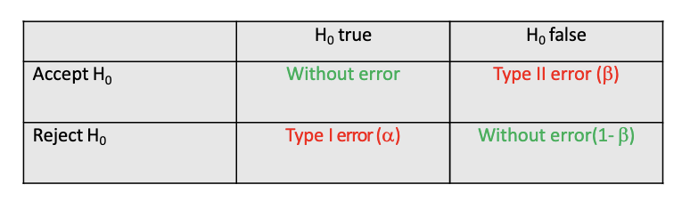

# Lesson 4 - Hypothesis testing; Parametric tests; Nonparametric testing

**Topic**: Hypothesis testing; Parametric tests; Nonparametric testing

## Hypothesis testing

### Introduction

With confidence intervals we can infer about a parameter in the population based on an estimate of that parameter.

Hypothesis tests are based on another different (but related) approach.

The idea now is to measure how much the results observed in the sample are compatible with a hypothesis about the population.

1. Define the hypothesis
  - H0 = null hypothesis - no effect on population
2. Set the significance level (alpha) - usually 0.05
3. Get the test statistic with the sample data and obtain the p-value: probability of obtaining the result we obtained or even more extreme, assuming H0 is true.
5. Interpret the p-value:
- if p < alpha, we have enough evidence to reject H0
- if p ≥ alpha, we do not have enough evidence to reject H0

### Hypothesis test - error

- **test power** = 1 – beta =  probability of rejecting H0 when false, that is, the ability of the test to detect differences when they exist.

a (alfa) is defined by us when we set the level of significance

To have a higher test power (1-β) we need:
- larger sample size
- smaller variability of observations
- higher effect
- higher a

## Parametric tests

### One Sample T-test

With a sample of individuals we want to know if the average of their population is a certain value.

Define the hypothesis and significance level (alpha)

- H0: Population mean equal to \( \mu_1 \)
- H1: Population mean is different than \( \mu_1 \)

Get the test statistic with the sample data

\( t = \frac{\bar{X} - \mu_1}{\frac{s}{\sqrt{n}}} \)

which follows a t-distribution with n-1 degrees of freedom

### Paired Sample T-test

With two paired samples of individuals, we want to know if the means of the two groups in the population are equal.

We define the Hypothesis
- H0: \( \mu_1 = \mu_2 \) or \( \mu_1 - \mu_2 = 0 \)
- H1: \( \mu_1 \neq \mu_2 \) or \( \mu_1 - \mu_2 \neq 0 \)

We set the significance level (alpha) - usually 0.05

We get the test statistic with the sample data
\( t = \frac{\text{mean of differences}}{\text{standard error of the differences}} \) which follows a t-distribution with n-1 degrees of freedom

We get the p-value

We interpret the value of p

### # Independent Sample T-test

With two independent samples of individuals we want to know if the means of the two groups in the population are equal.

We define the hypothesis
- H0: \( \mu_1 = \mu_2 \) or \( \mu_1 - \mu_2 = 0 \)
- H1: \( \mu_1 \neq \mu_2 \) or \( \mu_1 - \mu_2 \neq 0 \)

We get the test statistic with the sample data
\( t = \frac{(\bar{X}_1 - \bar{X}_2) - (\mu_1 - \mu_2)}{s_{p}\sqrt{\frac{1}{n_1} + \frac{1}{n_2}}} \), which follows a t-distribution with \( (n_1 + n_2 - 2) \) degrees of freedom

We set the significance level (alpha) - usually 0.05

We get the p-value

We interpret the value of p

**And if the variances are not equal, how to calculate sp?**

Levene's test tests the hypothesis that the variances are equal in both groups.
If they are not equal we cannot calculate the grouped estimate of standard deviations (sp) and we have to resort to a modified t-test.

### One-Way ANOVA – more than 2 groups

We define the null hypothesis:
H0: μ1 = μ2 = ... = μk
We will have a set of i groups with ni individuals each, a total of N individuals, an average of each group xi and a common average X

- Between groups variability
  - Between groups mean sum of squares (Between MS)
    \( \frac{\sum (\bar{X}_i - \bar{X})^2}{k - 1} \)

- Within groups variability
  - Within groups mean sum of squares (Within MS)
    Weighted mean of the groups variances

But beware: the variance has to be equal in all groups - Levene test.

It is proved that if \( \mu_1 = \mu_2 = \ldots = \mu_k \), then Between MS \( \sim \) Within MS

Otherwise, if \( \mu_1 \neq \mu_2 \neq \ldots \neq \mu_k \), Between MS will be higher than Within MS

So, to test H0: \( \mu_1 = \mu_2 = \ldots = \mu_k \), the F statistic is calculated

We set the significance level (alpha) - usually 0.05

We get the test statistic with the sample data
\( F = \frac{\text{Between MS}}{\text{Within MS}} \)

We get the p-value

We interpret the value of p

**When differences are found, it is sometimes important to know which groups are different.**

One solution is to make multiple comparisons (two by two), like this:
H0: μ1 = μ2
H0: μ1 = μ3
H0: μ1 = μ4
H0: μ2 = μ3
H0: μ2 = μ4
H0: μ3 = μ4

So... why didn't we do this from the beginning?

Suppose H0 true

We define the significance level  P(type I error) = 0.05  for each test.
We will have 6 tests to do.
How likely are you to make at least one type I mistake?
Is it 0.05?

The probability of making a type I error in at least one test is greater than 0.05!
So after doing one way ANOVA and if we want to identify which groups are different we can make multiple comparisons but we have to correct the level of significance.

- There are several fixes implemented in R:
Bonferroni, Sheffe, Tukey, etc

### Assumption of normality verification

- Graphical (histograms, etc...)
- Kolmogorov-Smirnov test
  - The usefulness of the K-S test is limited.
  - It has very little power with a small sample, i.e. it easily accepts normality for lack of contrary information.
  - It is also very sensitive when the sample is large, i.e. a significant p value is obtained with small deviations from the normal distribution in the sample.
