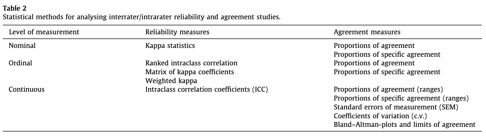
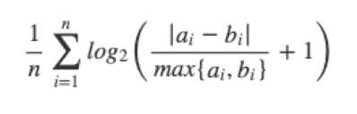

# Lesson 5

**Lecturer**: Professora Cristina Santos

**Topic**: Reliability and Agreement

## Context

- The quality of the measurements taken by health professionals or by measurement devices is fundamental  not only for clinical care but also for  research
- Measurement of variables always implies some degree of error.
- When an observer takes a measurement, thevalue obtained depends on several things such us:
  - the skills of the observer,
  - observer experience,
  - the measurement instrument,
  - observer’s expectations
  - ...
- Also, natural continuous variation in a biological quantity can be present.
- When natural continuous variation in a  biological quantity is present, it is outside the control of the observer.
- It is, however, possible to minimize the observer variability by:
  - training of observers,
  - use of guidelines
  - automation, ...
- Reliability and agreement studies before Validity studies / RCT / ...
- Agreement studies are very importante however neglected in medical literature

## Reliability versus Agreement
- The terms "reliability" and "agreement" are often used interchangeably.
- However, the two concepts are conceptually distinct

- **Reliability** can be defined as the ability of a measurement to differentiate between subjects.
  - Reliability may be defined as the ratio of variability between subjects (e.g., patients) or objects (e.g., computed tomography scans) to the total variability of all measurements in the sample
- **Agreement** is the degree to which scores or ratings are identical.
- Both concepts are important, because they provide information about the quality of measurements.
- The study designs for examining the two concepts are similar.

- We focus on two aspects of these concepts:
  - **Interrater agreement/reliability** (different raters, using the same scale, classification, instrument, or procedure, assess the same subjects or objects).
  - **Intrarater agreement/reliability** (also referred to as test–retest) (the same rater, using the same scale, classification, instrument or procedure, assesses the same subjects or object at different times).

## Reliability measures
- Nominal:
  - Kappa statistics
- Ordinal:
  - Ranked intraclass correlation
  - Matrix of kappa coefficients
  - Weighted kappa
- Continuous:
  - Intraclass correlation coefficients

## Agreement measures
- Nominal and ordinal:
  - Proportions of agreement
  - Proportions of specific agreement
- Continuous:
  - Proportions of agreement (ranges)
  - Proportions of specific agreement (ranges)
  - Standard errors of measurement
  - Coefficients of variation
  - Brand-Altman plots and limits of agreement

## Cohen's Kappa coefficient

Two raters are asked to classify objects into categories 1 and 2.
The table below contains cell probabilities for a 2 by 2 table.

|       | Rater #1 |         |       |       |
|-------|:--------:|:-------:|:-----:|:-----:|
|       |       |     1    |    2    | Total |
| Rater #2 | 1 | p11 | p12 | p1. |
|       | 2 | p21 | p22 | p2. |
|       | Total | p.1 | p.2 | 1 |

**Proportions of agreement** (Po) = P11 + P22

**Proportions of expected by chance** (Pe) = P.1 P1. + P.2 P2.

K = (Po - Pe) / (1 - Pe)

- Chance-Corrected Agreement? Or measure of reliability?

### High agreement but low kappa

Example:
| Observer 2 | Observer 1 |       |       |
|------------|:----------:|:-----:|:-----:|
|            |    yes     |   no  | total |
| yes        |     40     |   5   |  45   |
| no         |     3      |   2   |  5    |
| total      |     43     |   7   |  50   |

PA=42/50=0.84
Pe=(43/50)(45/50)+(7/50)(5/50)=0.79
K=(0.84-0.79)/(1-0.79)=0.24

#### Specific agreement

**Summary of binary ratings by two raters**:

| Rater 1 | Rater 2 + | Rater 2 - | total      |
|---------|:---------:|:---------:|:----------:|
| +       | a         | b         | a + b      |
| -       | c         | d         | c + d      |
| total   | a + c     | b + d     | N          |

The values a, b, c and d here denote the observed frequencies for each possible combination of ratings by Rater 1 and Rater 2.

Proportion of overall agreement = (a+d)/N

**Positive Agreement** estimates the conditional probability, given that one of the raters, randomly selected, makes a positive rating, the other rater will also do so

PA = \(\frac{2a}{2a + b + c}\)

**Negative Agreement** estimates the conditional probability, given that one of the raters, randomly selected, makes a negative rating, the other rater will also do so

NA = \(\frac{2d}{2d + b + c}\)

**Application on the example:**
PA  yes = 40x2/(40x2+3+5)=0.92
PA no = 2x2/(2x2+3+5)=0.33

## Intraclass Correlation Coefficient

The Intraclass Correlation (ICC) assesses rating reliability by comparing the variability of different ratings of the same subject to the total variation across all ratings and all subjects.

## Information Based Measure of Disagreement

> The sum over all logarithms of possible outcomes of the variable is a valid measure of the amount of information, or uncertainty, contained in a variable.

*Costa-Santos C. et al. Assessment of Disagreement: A New Information-Based Approach. ANNALS OF EPIDEMIOLOGY. 20(7):555-561*

Consider that we aim to measure disagreement between measurements obtained by Observer Y and Observer X. The disagreement between Y and X is related to the differences between them. So, we consider

the amount of information contained in the differences between observers.

By adding 1 to the differences, we avoid the behavior of the logarithmic function between 0 and 1.
To get a value between 0 and 1 we normalize the amount of information contained in the differences to  obtain the following measure of information-based measure of disagreement (IBMD):

0 – no disagreement
Tends to 1 (total disagreement)

## Bland and Altman limits of agreement

> Difference against mean

- Provided differences within mean differences +/- 2SD would not be clinically important, we could use  the two measurement methods interchangeably.
- It is a clinical (not statistical!) interpretation.
