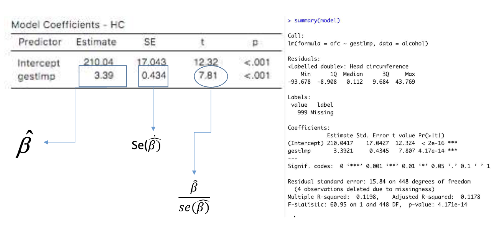

# Lesson 6 - Chi-squared test; Simple Linear Regression

**Topic**: Chi-squared test; Simple Linear Regression

# Chi-squared test

# Statistical Methods
Broad division of statistical methods
- **Descriptive**: Summarize and simplify the Information
- **Modeling**: Create models to understand complex relations in the data
- **Inference**: Evaluate the precision and generalize the results

The choice of descriptive and inferential methods   depend:
– Research question
– Design type
– Type of variable collected
– Distributional assumptions

## Descriptive Methods
The Descriptive methods aim to summarize information.

- **Summary measures**
  - Single Variable
    - Frequency: counts, percentage, rate, risk, odds, prevalence,incidence
    - Central tendency and position: mean, median, minimum, maximum,percentiles
    - Dispersion: standard deviation (variance), range (e.g. interquartilerange)
  - Two variables
    - Association: correlation, relative risk, odds ratio, hazard ratio, mean difference, risk difference
    - Agreement: kappa statistics, intraclass correlation, sensitivity, specificity, area under the ROC curve

## Inference Methods
With methods for inference we draw conclusions about
the population using the sample results

- **Confidence intervals**
- **Hypothesis Testing**
  - Parametric: t-test, ANOVA
  - Non-parametric: Mann-Whitney, Wilcoxon...

## Modeling Methods
- Typically, we use statistical models to describe the  relation of one outcome (dependent variable) with  multiple variables (covariates or independentvariables)
- We refer to these methods as multivariablemethod (multivariaterefers to multiple outcomes and multiple covariates)
- The choice of the model will depend:
  – Research question
  – Design type
  – Type of outcome
  – Distributional assumptions

**Why do we care about modeling?**
1. Descriptive - describe strength of the association between outcome and factors of interest eliminating "noise"
2. Adjustment - for covariates/confounders; e.g. compare mortality between hospitals adjusting for the patients’ case-mix
3. Predictors - to determine important risk factors affecting the outcome; e.g.identify risk factors associated with cardiovascular disease
4. Prediction - prognostic/diagnostic; e.g.severity scores (APACHE, SAPS; PRIMS,MPM,...)

# Regression

- Regression analysis is a broad term for statistical models of the form g(Y)= f(X,β)
  - Where Y stands for the outcome (dependent)  variable(s), X is vector of covariates, β is the vector of  regression parameters, f is some function (known or unknown) and g is a known function.
- Linear regression, logistic regression, Poisson regression, Cox regression

# Simple Linear Regression

## Regression Line

## Least squares

- We have defined: `ε = y - y^pred`
- For each observation (individual) `i` we have:
  - `ε_i = y_i - y^pred_i = y_i - α - βx_i`
    - This represents the value of `x` for the individual `i`
- The main idea is to minimize the sum of the squared errors
  - **Sum of squares** = `Σ (ε_i)^2 = Σ (y_i - α - βx_i)^2`
- The reason we square the errors is to "eliminate" the signs of the errors

- To minimize the sum of squares we first find the zero of the first derivatives:
  - The derivative of the sum of squares with respect to α:
    `∂(sum of squares)/∂α = 0 <=> Σ -2(y_i - α - βx_i) = 0`
  - The derivative of the sum of squares with respect to β:
    `∂(sum of squares)/∂β = 0 <=> Σ -2x_i(y_i - α - βx_i) = 0`

- We can show that this solution is a minimum and it is known as the **ordinary least squares estimator (OLS)** for the regression parameters.

The OLS estimator is the best estimator under the following assumptions:
- The association of x and y is linear, i.e., the model for the mean of y is correctly specified
- The observations are independent
- Fixing x, y is normally distributed (i.e.the errors,or residuals,are normally distributed)
- Fixing x, the standard deviation for y is the same for all x’s  (homoscedasticity)

## Inference
- Note that α̂ and β̂ are estimators of the true α and β (population parameters) based on the sample
- Usually, we want to make inference about β

- The typical question after fitting the model is about the existence of a statistically significant “effect” of the covariate x on the outcome y
  - The “effect” of x on y is given by β

This corresponds to test the null hypothesis H0:β = 0
The observed data allow us to test this hypothesis.How?

We can show that the standard error of β̂ is given by:

Typically, we do not know σyx but we can estimate se(β̂) using an estimator for σyx.

So, to test the null hypothesis H0: α=0 in the example

Having the standard error for the regression parameters estimates we can also compute a  confidence interval (CI) for α and β.

The 95% confidence interval (CI) for β̂ is calculated as:

`CI_95%(β̂) = β̂ ± 2 × se(β̂)`
For the given estimates:
`CI_95%(β̂) = 3.4 ± 2 × 0.4`
Which simplifies to:
`CI_95%(β̂) = [2.6; 4.2]`

- What about \( \hat{y}_{pred} \)? The predicted value for \( y \) (given the covariate \( x \)) is based on the parameters estimates! So it is also an estimated value of the "true" \( y_{pred} \)

\( \hat{y}_{pred} = \hat{\alpha} + \hat{\beta}x \)

- Therefore, it is also possible to construct a confidence interval for \( \hat{y}_{pred} \)

- However, we have to be specific about the meaning of \( y_{pred} \)

- Notice that if we want to estimate \( \mu_{y|x} \), the expression is the same but the meaning is different:

\( \hat{\mu}_{y|x} = \hat{\alpha} + \hat{\beta}x \)

- \( y_{pred} \) is the prediction of \( y \) for **an individual** that has a certain \( x \)
- \( \mu_{y|x} \) is the **average of \( y \)** for **individuals** with a certain \( x \)
- The estimates for both quantities are the same but the confidence intervals are very different.
- The reason for this has to do with the standard errors (se) of the estimates:

The standard error for the mean prediction is given by:

\( se(\hat{\mu}_{y|x}) = s_{y|x} \sqrt{ \frac{1}{n} + \frac{(x - \bar{x})^2}{\sum_{i}(x_i - \bar{x})^2} } \)

And the standard error for an individual prediction is:

\( se(\hat{y}_{pred}) = \sqrt{s^2_{y|x} + se(\hat{\mu}_{y|x})} \)

- `y_pred` is the prediction of `y` for **an individual** that has a certain `x`
- `μ_y|x` is the **average of `y`** for **individuals** with a certain `x`
- Since the confidence interval for both estimates depends on `x`, we can plot the CI for "all" `x`'s
- The intervals obtained are called the confidence bands

## Model evaluation

### Assumptions

Once we have the regression line, we should check
- how well the model fits the data (goodness offit), and
- the model assumptions:
  - The model for the mean is correctly specified
  - The distribution of the residuals is normally distributed
    – Or equivalently, y|x is normally distributed
  - Homoscedasticity
    - Equal variance of y for every x

#### Checking for Assumptions
- A common way of checking the model assumptions is to look at the residuals
- The points should scatter around zero with no clear pattern  and with similar dispersion.

### Goodness of fit

- How well the model fits the data or
- How well x predicts y or
- How much of the variance of y is explained by x or
- How good is the linear relation between x and y

- **Pearson’s  correlation (r)**: statistics that measures the linear relation between x and y
- **r^2** gives the amount of variation on y that is explained by x
- Another way of deriving this statistics (r^2) is to write the **ANOVA table**
  - The variation of \( y \) can be expressed by the sum of squares of \( y \)
  - Total sum of squares = \( \sum (y_i - \bar{y})^2 \)
  - The total sum of squares can be decomposed as:
  \( \sum (y_i - \bar{y})^2 = \sum (y^{pred}_i - \bar{y})^2 + \sum (y_i - y^{pred}_i)^2 \)
  - *Total sum of squares* = *Explained sum of squares* + *Residual sum of squares*

- So, r^2 may be used as a mesure of goodness of fit
- An inference question could be formulated regarding the sum squares:
  - Is the amount of variation explained by the model (explained  sum of  squares) significantly different from zero?
  - For the example, p<0.001 so we can conclude that the amount of variation explained by the model is significantly different from 0

Note:
- Intuitively the last question may seem related to a previous inference question about the statistically  significant “effect” of the covariate x on the  outcome y:
H0: β=0
- In fact both tests (testing β and testing the explained sum of squares) are equivalent for the case of simple linear regression

## Summary of Interpretations and Concepts

**Assumptions:**
- The association of x and y is linear, i.e., the model for the mean of y is correctly specified
- The observations are independent
- Fixing x, y is normally distributed (i.e.the errors,or residuals,are normally distributed)
- Fixing x, the standard deviation for y is the same for all x’s  (homoscedasticity)

- **Pearson’s  correlation (r)**: statistics that measures the linear relation between x and y
- **r^2** gives the amount of variation on y that is explained by x
- Another way of deriving this statistics (r^2) is to write the **ANOVA table**
- *Total sum of squares* = *Explained sum of squares* + *Residual sum of squares*
- So, r^2 may be used as a mesure of goodness of fit
- An inference question could be formulated regarding the sum squares:
  - Is the amount of variation explained by the model (explained  sum of  squares) significantly different from zero?
- Intuitively the last question may seem related to a previous inference question about the statistically  significant “effect” of the covariate x on the  outcome y:
H0: β=0
- In fact both tests (testing β and testing the explained sum of squares) are equivalent for the case of simple linear regression
