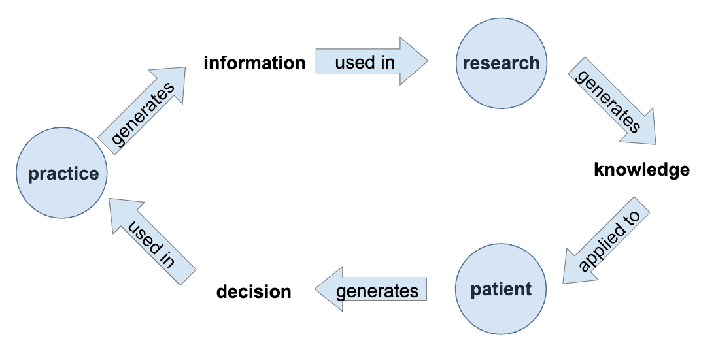
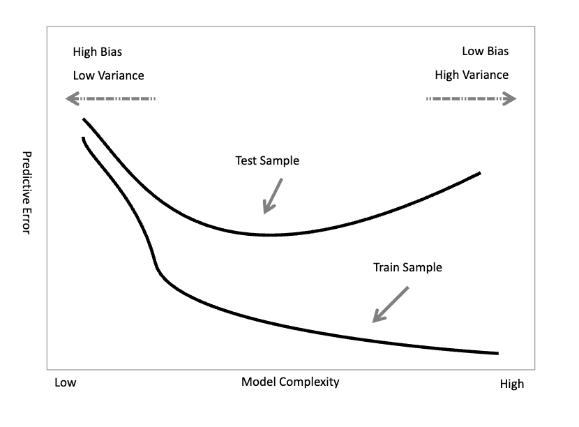

# Lesson 10 - Learning and evaluating classifiers

**Topic**: Learning and evaluating classifiers

## Introduction

**Evidence Based Medicine**
> “Conscient, explicit and criterioususe of the best available evidence in clinical decision”
> Sackett D. (1996)

**Real-World Biomedical Data**
> “The complicated nature of real-world biomedical data has made it necessary to look beyond traditional biostatistics.”
> Lucas P. (2004)

**Wealth of Health Data**
> “The routine operation of modern healthcare systems produces a wealth of data in electronic health records, administrative databases, clinical registries, and other clinical systems.”
> Peek & Rodrigues (2018)

**Knowledge Discovery**
> “It is widely acknowledged that there is great potential for utilizing these routine data for health research to derive new knowledge about health, disease, and treatments.”
> Peek & Rodrigues (2018)

**Data Science**
> “Study on creation, validation and transformation of data to generate meaning.”
> Data Science Association (2020)

**Clinical Knowledge Representation**
> “Clinical cases are getting more and more complex, yielding the application of modelling techniques likewise increasingly complex.”
> Lucas P. (2014)

**Machine Learning**
> “The field of machine learning is concerned with question of how to construct computer programs that automatically improve with experience”
> Mitchell (1997)

**Supervised Machine Learning Metaphor**
> “There is a teacher who teaches the system a concept, with which the student is able to classify new cases, and there is an error function for that classification.”
> Hastie T., TibshiraniR. & Friedman J. (2001)

## Inductive Bias

An algorithm that learns automatically from a set of data looks for a hypothesis, in the space of possible hypotheses, that best fits the training data.

Each algorithm chooses a representation for this hypothesis.
- The chosen representation represents a **representation bias**
- The way the algorithm searches for the hypothesis represents a **search bias**

> “A learner that makes no a priori assumptions regarding the identity of the target concept has no rational basis for classifying any unseen instances.”
> Mitchell (1997)

**Black boxes**
> “Some machine learning techniques, although very successful from the accuracy point of view, are very opaque in terms of understanding how they make decisions.”
> EU Commission (2019)

### Hypothesis Induction

- Creating a model from a data set is to induce a hypothesis of association between factors (or between factors and a result), as opposed to deducing models from a theory.

- We seek hypotheses as correct as possible, i.e. whose model thus formed fits the observed data as well as possible.

### Model Generalization

We can increase the complexity of the model in an attempt to improve:
- the representation of reality
- the adequacy of the model to the data
- the ability to support decisions

*but...*

**Model Performance**
> “The generalization performance of a learning method relates to its prediction capability on independent test data.”
> Hastie T., Tibshirani R. & Friedman J. (2001)

We say that the model is **overfitting**, that is, that it overfits the seen data, memorizing them, when the performance in the test data is much lower than in the training data.
We say that the model is **underfitting**, that is, that it did not adjust to the seen data, when the performance is low even in the training data.

## Evaluating Predictive Models

There is no universal technique for all induction problems!
We need to evaluate each technique according to the objective of the studied problem:

- The theoretical evaluation can be exposed, for example, by the inductive characteristics (bias and variance) of the applied models.
- The controlled experimental evaluation must follow clear and transparent assumptions and procedures in order to guarantee the validity of the created models.

**Error Metrics**
The evaluation of a supervised model is usually performed by analyzing the performance in the classification of new cases, e.g:
- Proportion of correctly classified cases (accuracy, sens, spec, precision, F1, ...)
- Distance between predicted and actual values (e.g. mean squared error)
- ...

But is it possible to understand / explain the origin of the error?

- The type of decision and the type of model built may make such an analysis impossible.
- The decision is usually based on the discrimination of a continuous value, e.g. a probability.
- The ROC curves allow the analysis of the impact of these parameters on the error.

**Estimating Generalized Error**
Calculating the classification error on the same data used to train the model produces optimistic estimates, which is why it was agreed to call this the apparent error of the model.
We must use strategies for error estimation in alternative, independent samples.

Sampling methods for estimating generalized error:
1. Holdout
2. Random sampling (random subsampling)
3. Cross-validation
4. Leave-one-out
5. Bootstrap

### Holdout

A set of data is separated (e.g. 1/3) which are not used in training (derivation) of the model.
Estimation of the error is calculated in these held out test set.

**Problems:**
- Estimate is pessimistic (final model trained with all the data will be better than just with the training set)
- It does not allow to evaluate the variability of performance with different combinations of the data (we may have ended up with an “easy” test set)
- How to choose the test set?

### Random sampling

The holdout procedure is repeated several times, with equal proportions but random selection of the test set.
Estimation of the error is aggregated (e.g. mean and standard deviation) from among the various test sets.

**Problems:**
- It does not allow to evaluate performance in all existing cases (random selection does not guarantee that all cases have been used in a test set)

### K-folds cross-validation

The data is divided into K sub-sets of equal size; K-1 are used for training, and the rest is the test set.
The procedure is repeated K times, in order to use all the subsets as a test.
Estimation of the error is aggregated (e.g. mean and standard deviation) from the predictions in the K test sets.

**Problems:**
- A portion of the training data is shared between the different runs (i.e. not independent).
- Aggregate performance estimate is still dependent on the division made.
- How to divide the data by the K groups?

**Specifications:**
- It is usual to perform the complete procedure several times (M) to allow different definitions of the groups, with the estimate to be aggregated among all M * K executions
- It is usual to stratify the groups, i.e., to force that both the training set and the test set have similar class proportions.
- There are several studies that discuss the validity of the method, namely with regard to  the optimism / pessimism of each estimate

### Leave-one-out cross-validation

Equivalent to an N-folds cross validation, where N is the total number of cases in the set.
Estimation of the error is aggregated in the N predictions made.
Probably the most accurate estimate of the model's performance.

**Problems:**
- Computationally more demanding.
- Usually used only in small data sets.

### Bootstrap

Samples are drawn from the data set, with replacement, of the same size as the initial set, serving as training sets. Unchosen cases (~ 36.8%) serve as a test set. Procedure is repeated several times.
The error estimate is aggregated from all iterations(equivalent to leave-one-out, but with less variance).

**Problems:**
- Computationally very demanding.
- Usually used only in small data sets.